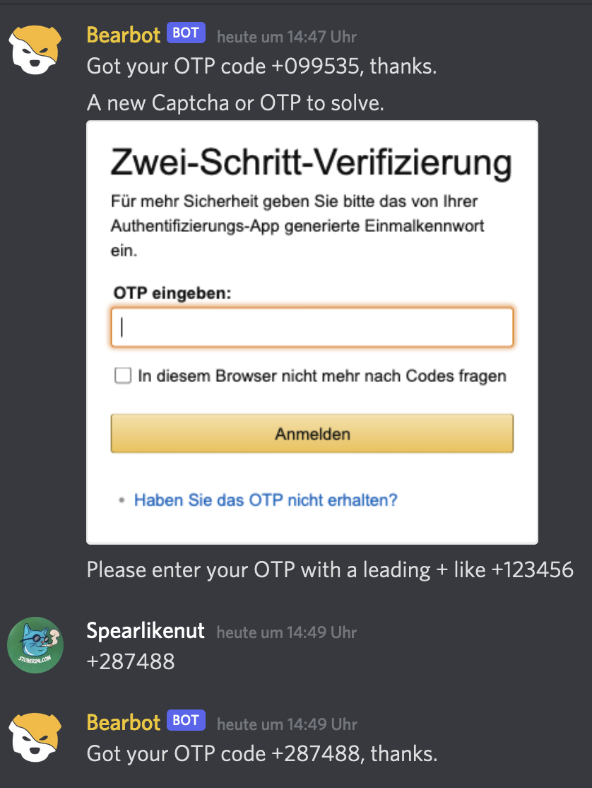

# Amazon Job Apply
I used this on the german Amazon job site to apply to a german job. Should probably work internationally with a few tweaks. Use it at your own risk, I am not gonna be responsible if you get blocked or don't get a job because of this.

Anyways, wrote this because I thought it will give me an edge with my application as a Security Engineer for Robot Detection.

<p align="center">
  
</p>

## Setup
```
pip3 install requirements.txt 
```
You WILL have to set up a Discord Bot for this, I mainly have to do this because I use MFA for everything (you should too) and in order to solve it from anywhere in the world Discord seemed like an easy solution. The `pycord`library I use makes it tricky to send messages with other sripts (like you cant import send and use it, because bot.run will block..so I had to use the hacky way)

#### Chromedriver 
I give you 2 options here: either you use undetected-chromedriver (for serious stuff I'd recommend) OR you use ChromeDriverManager which will to all the boring update and download of chromedriver for you.

### .env
Yours should look like this (except with your values) and be in the same directory as `amazon_job.py`.
```
AMAZON_EM=bot.daddy@evil.fail
AMAZON_PW=Password123
DISC_KEY=hcbueb3uifnot.real.h3oHURHOE.cj3uh94hnci.efjeunekncvioeunvuiernvo
DISC_CHANNEL=9893859notreal3283245
```

### Directory Structure
the script expects an amazon directory for saving screenshots in there, the .env an amazon_job.py to be in the same directory.
```
projekt > amazon_job.py ,.env , amazon/
```

